# Lab 01 - Um estudo das características de qualidade de sistema java

Integrantes:

- Fernando Couto
- Tito Chen
- Vinicius Lima

## Introdução

**Objetivo**:
Nosso objetivo nesta pesquisa é analisar a qualidade do código e a maturidade dos repositórios mais populares no GitHub, especificamente aqueles desenvolvidos na linguagem Java. A partir de hipóteses informais, esperamos que repositórios com maior número de estrelas (indicador de popularidade) apresentem melhores métricas de qualidade de código, como coesão, acoplamento e herança, além de possuírem maior número de linhas de código (LOC) e um ciclo de lançamentos mais frequente.

**Linguagem de programação**: Python 3

**Dependências**:

- matplotlib (gráficos)
- requests (chamadas http para GitHub API)
- csv (salvar o csv com os dados)  
- pandas (leitura do csv gerado)
- subprocess (rodar comandos de git clone e processar o ck)

**API utilizada**: Foi utilizada a GitHub API para coletar os dados necessários dos repositórios

## Hipóteses informais
- Repositórios com mais estrelas terão métricas de qualidade de código superiores (menor acoplamento, maior coesão e profundidade de herança mais eficiente).
- Repositórios com mais lançamentos serão mais maduros em termos de LOC e melhores práticas de código.
- Repositórios mais antigos terão métricas de qualidade de código mais aprimoradas devido à evolução contínua ao longo do tempo.

## Metodologia
###Coleta de Dados:
Utilizamos a API do GitHub para coletar os 1000 repositórios mais populares em Java, com base no número de estrelas. Para cada repositório, extraímos informações como o número de estrelas, lançamentos e a idade do repositório.

### Análise de Métricas de Código:
Utilizamos a ferramenta CK para calcular métricas de código, como:

- CBO (Coupling Between Objects) – Indicador de acoplamento.
- DIT (Depth of Inheritance Tree) – Profundidade da árvore de herança.
- LCOM* (Lack of Cohesion of Methods) – Falta de coesão entre os métodos.
- LOC (Lines of Code) – Linhas de código.

### Processamento dos Dados: 
Combinamos as métricas de qualidade de código com os dados coletados da API do GitHub para gerar um arquivo CSV. Um passo adicional foi feito para calcular a idade dos repositórios e incluir essa informação no CSV.

### Análise Estatística:
Calculamos as médias das métricas de qualidade de código e comparamos esses valores com a popularidade (número de estrelas) e a idade dos repositórios para validar as hipóteses.

## Resultados
#### RQ 01. Qual a relação entre a popularidade dos repositórios e as suas características de qualidade?
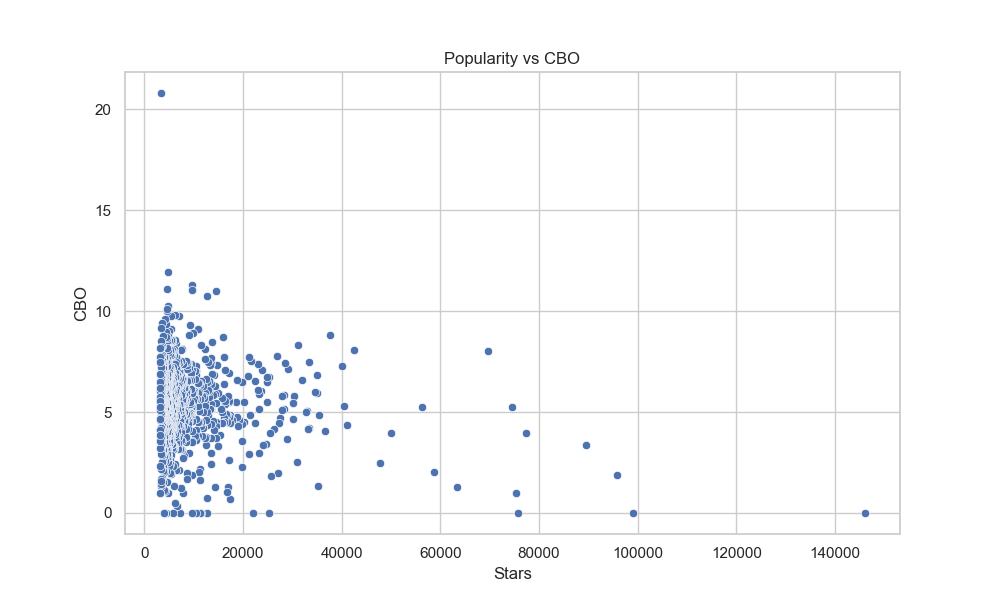
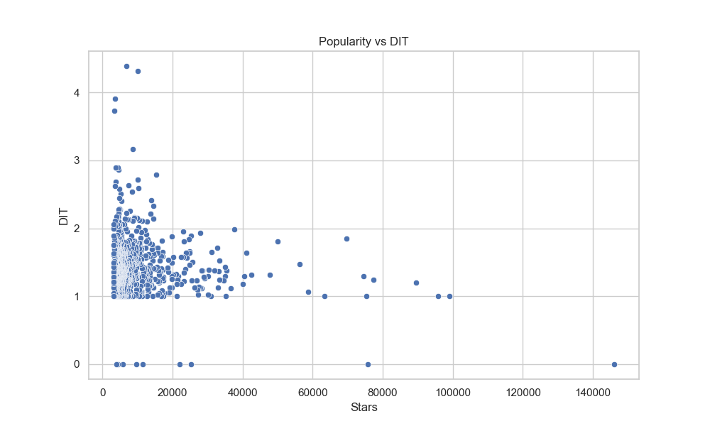
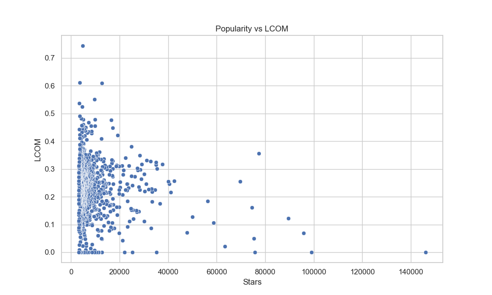

#### RQ 02. Qual a relação entre a maturidade do repositórios e as suas características de qualidade ?
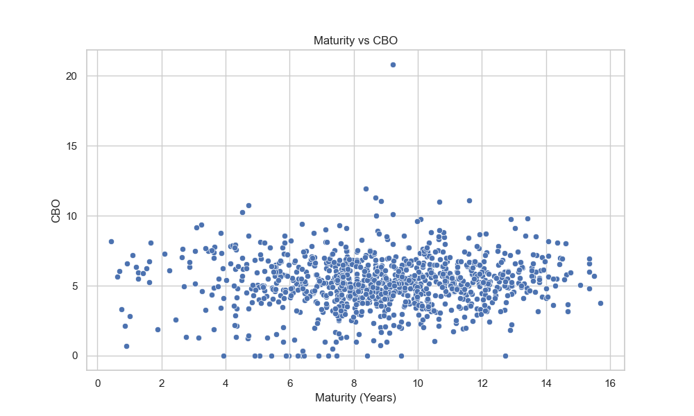
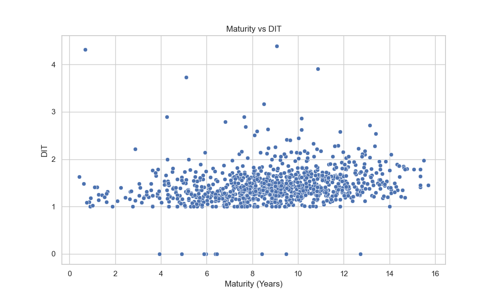
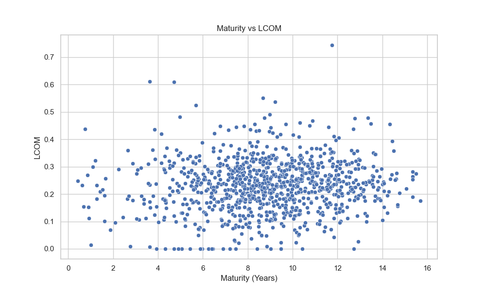

#### RQ 03. Qual a relação entre a atividade dos repositórios e as suas características de qualidade?
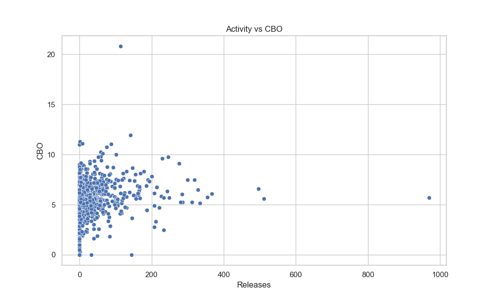
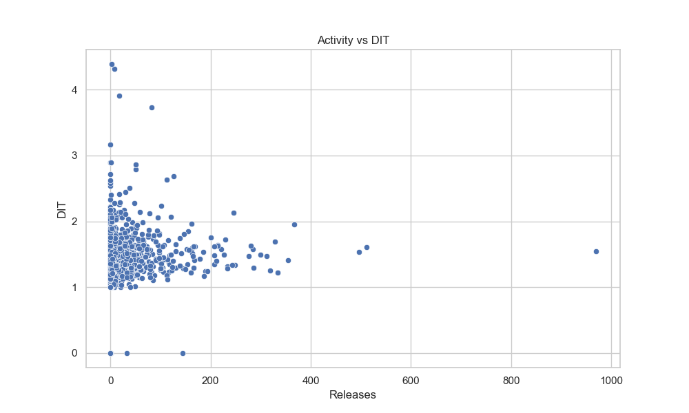
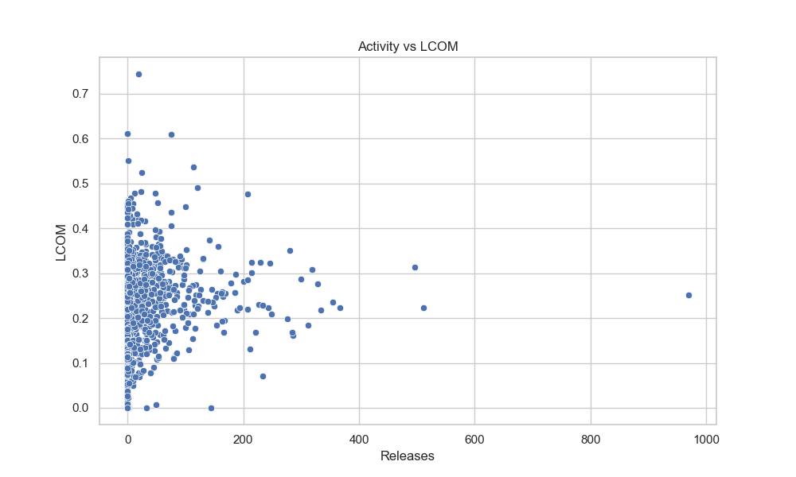

#### RQ 04. Qual a relação entre o tamanho dos repositórios e as suas características de qualidade?
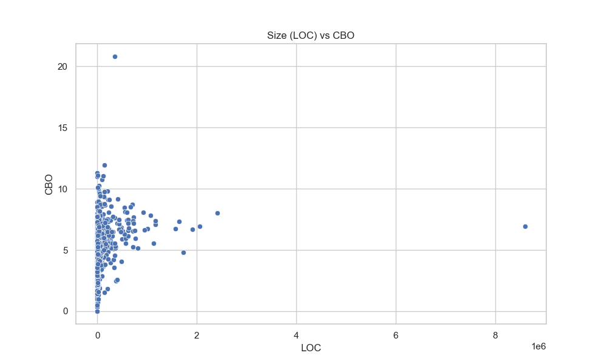
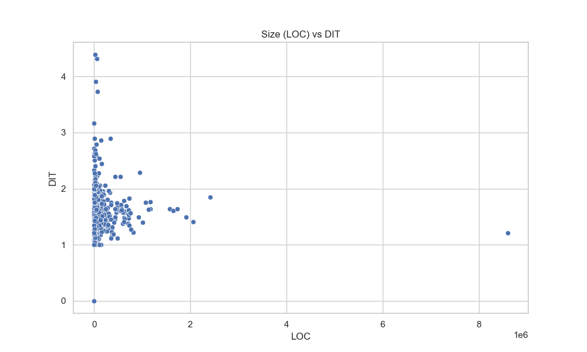
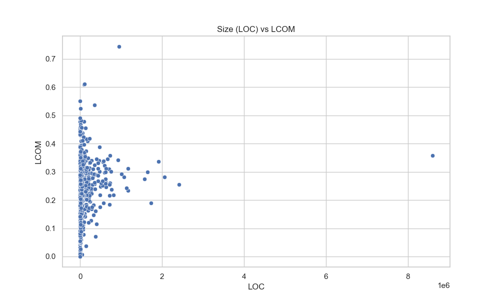
